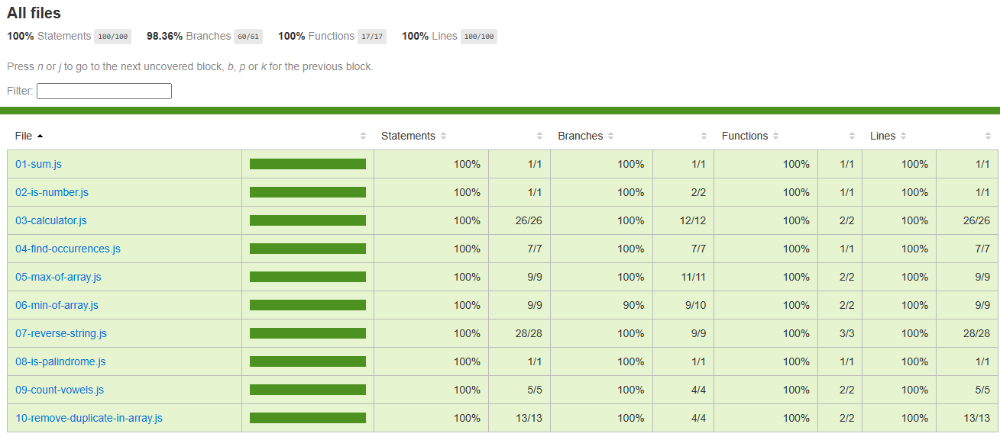

# JavaScript Data Structures and Algorithms

This repository is dedicated to implementing various data structures and algorithms in JavaScript, leveraging the knowledge gained from studying the subject. The implementation is done using Vite for project setup and Vitest for unit testing. Most of the implemented functions utilize advanced, modern features of JavaScript.

## Part 1: Basic Challenges

In the initial part, I've covered basic challenges to solidify understanding and implementation skills. These challenges serve as a foundation for deeper topics to be covered in the future.

1. **Sum of Numbers:** Write a function to calculate the sum of numbers in an array.

2. **Is Number:** Write a function to check if a given value is a number.

3. **Calculator:** Implement a basic calculator that can perform addition, subtraction, multiplication, and division operations.

4. **Find Occurrences in String:** Write a function to find the occurrences of each character in a given string.

5. **Maximum of Array:** Write a function to find the maximum value in an array.

6. **Minimum of Array:** Write a function to find the minimum value in an array.

7. **Reverse a String:** Write a function to reverse a given string.

8. **Is Palindrome:** Write a function to check if a given string is a palindrome.

9. **Count Vowels in a String:** Write a function to count the number of vowels in a given string.

10. **Remove Duplicates:** Write a function to remove duplicate elements from an array.

## Future Plans

In the future, I plan to delve deeper into more advanced topics and challenges. The progression will gradually cover a wider range of data structures and algorithms, offering opportunities for learning and improvement.

## Getting Started

To get started with the project:

1. Clone repository

```bash
git clone https://github.com/thanusan-kanagnethiran/javascript-dsa.git
```

2. Install dependencies

```bash
npm run i
```

3. To Run and test use the scripts below

```json
{
  "scripts": {
    "dev": "vite", // start dev server, aliases: `vite dev`, `vite serve`
    "build": "vite build", // build for production
    "preview": "vite preview", // locally preview production build,
    "test": "vitest", // run unit tests.
    "coverage": "vitest run --coverage" // to produce test coverage.
  }
}
```

<p align="center">
  
</p>

## Contributing

Contributions are welcome! If you have suggestions for improving existing functions or want to propose new approaches, feel free to submit pull requests. However, please refrain from creating new functions that are not within the scope of the existing challenges.

Please make sure to update tests as appropriate.

#### Pull Request Guidelines:

- Ensure unit tests and coverage must maintained at 100%.
- Take the time to document and comment your code for better understanding.
- Propose improvements or optimizations with clear explanations.

## Appendix: Additional Information

### Resources

- [Make a README](https://www.makeareadme.com/): An online tool to help you create well-structured README files.
- [JavaScript Challenges by Brad Traversy](https://github.com/bradtraversy/traversy-js-challenges): A repository containing JavaScript challenges for practice and learning.

### Author

- **Name:** Thanusan Kanagnethiran
- **LinkedIn:** [Connect with me](https://lk.linkedin.com/in/thanusan-kanagenthiran)

### Acknowledgements

- Inspired by Brad Traversy's JavaScript challenges.

## License

[MIT](https://choosealicense.com/licenses/mit/)
